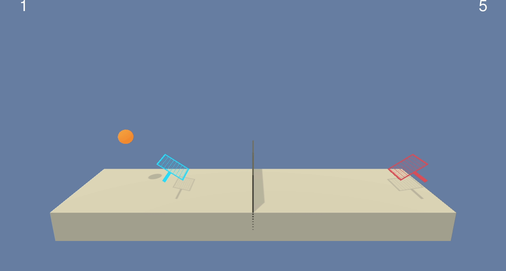
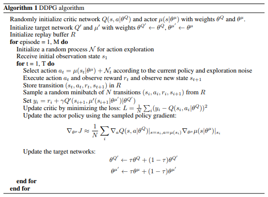
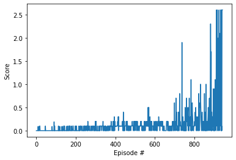

## Project3: Collaborative Tennis

### Environment and goal:
In this environment, two agents control rackets to bounce a ball over a net. If an agent hits the ball over the net, it receives a reward of +0.1.  If an agent lets a ball hit the ground or hits the ball out of bounds, it receives a reward of -0.01.  Thus, the goal of each agent is to keep the ball in play.

The observation space consists of 8 variables corresponding to the position and velocity of the ball and racket. Each agent receives its own, local observation.  Two continuous actions are available, corresponding to movement toward (or away from) the net, and jumping. 

The task is episodic, and in order to solve the environment, your agents must get an average score of +0.5 (over 100 consecutive episodes, after taking the maximum over both agents). Specifically,

- After each episode, we add up the rewards that each agent received (without discounting), to get a score for each agent. This yields 2 (potentially different) scores. We then take the maximum of these 2 scores.
- This yields a single **score** for each episode.

The environment is considered solved, when the average (over 100 episodes) of those **scores** is at least +0.5.

### Method used:
To solve this challenge, I trained and used a Deep Deterministic Policy Gradient  ([DDPG](https://arxiv.org/pdf/1509.02971.pdf)) agent treating both agents as one with a state size of 48 and action size of 4 by flattening the states received from the environment

DDPG uses an actor network to directly esitmate the policy for the agent and a critic to estimate state action values to overcome the actor's high variance.

`Description of the algorithm, Taken from “Continuous Control With Deep Reinforcement Learning” (Lillicrap et al, 2015)` 

### Networks architecture:
it is the same as my implementation for [continuousControl-drl](https://github.com/alleboudy/continuousControl-drl) which I find really satisfying being able to generalize the solution for two different setups!
- Actor(
  - (fc0): Linear(in_features=48, out_features=128, bias=True)  this layer takes the state as input
  - Followed by a leaky relu activation
  - (bn0): BatchNorm1d(128, eps=1e-05, momentum=0.1, affine=True, track_running_stats=True)
  - (fc1): Linear(in_features=128, out_features=128, bias=True)
  - Followed by a leaky relu activation
  - (bn1): BatchNorm1d(128, eps=1e-05, momentum=0.1, affine=True, track_running_stats=True)
  - (fc2): Linear(in_features=128, out_features=4, bias=True)
  - Followed by a tanh activation for the four output actions each of value between -1 and 1
)

The idea behind the applied batch normalization for the actor is to keep the network values small and not abruptly dimish them with just the tanh at the output.

- Critic(
  -   (fcs1): Linear(in_features=48, out_features=256, bias=True)  this layer takes the state as input
  - Followed by a leaky relu activation
  - (fc2): Linear(in_features=260, out_features=128, bias=True) this layer is a concatination of the previous layer and the actions
  - Followed by a leaky relu activation
  - (fc3): Linear(in_features=128, out_features=1, bias=True)
)

and of course, the target actor and target critic are the same as these.

### Project files:
- `model.py` contains the Actor and the Critic network implementations, following closely udacity's implementation for [ddpg-bipedal](https://github.com/udacity/deep-reinforcement-learning/tree/master/ddpg-bipedal) with a few modifications

- `ddpg_agent.py` the ddpg agent, also following closely udacity's implementation in the mentioned link with a few modifications

- `ContinuousControl-Tennis.ipynb` the notebook driving the training process
- `trained_actor.pth` a trained actor
- `trained_critic.pth` a trained critic
- `play_trained_agent.ipynb` a notebook to play the environment used the trained actor and critic
- `per/*` an [implementation](https://github.com/rlcode/per) of a priority experience buffer by [jcwleo](https://github.com/jcwleo) with a few tweaks to work with my project setup

### Hyperparameters used:
similar to the udacity's implementation for [ddpg-bipedal](https://github.com/udacity/deep-reinforcement-learning/tree/master/ddpg-bipedal) with a few modifications
Which are very similar to my previos implementation in [ddpg-bipedal](https://github.com/udacity/deep-reinforcement-learning/tree/master/ddpg-bipedal) with a few modifications

- `BUFFER_SIZE = int(1e3)`    # replay buffer size
- `BATCH_SIZE = 128`          # minibatch size
- `GAMMA = 0.99`              # discount factor
- `TAU = 1e-2`              # for soft update of target parameters
- `LR_ACTOR = 1e-3`         # learning rate of the actor
- `LR_CRITIC = 3e-4`        # learning rate of the critic
- `WEIGHT_DECAY = 0.0000`   # L2 weight decay, not used
- `ACTOR_HIDDEN = 128`		# number of neurons in the actor's hidden layers
- `CRITIC_HIDDEN1 = 256`  # number of neurons in the critic's first hidden layer
- `CRITIC_HIDDEN2 = 128`  # number of neurons in the critic's second hidden layer

and a seed of 13 for reproducibility

### Training results:
- Episode 100	Average Score: 0.01
- Episode 200	Average Score: 0.02
- Episode 300	Average Score: 0.04
- Episode 400	Average Score: 0.06
- Episode 500	Average Score: 0.10
- Episode 600	Average Score: 0.11
- Episode 700	Average Score: 0.09
- Episode 800	Average Score: 0.18
- Episode 900	Average Score: 0.27
- Episode 944	Average Score: 0.51
- Environment solved in 944 episodes!	Average Score: 0.51

### Future work:
- Exploring Multi-agent algorithms to solve this environment like MADDPG.
- Experimenting with a competitive setting of the environment, which I expect to be more challenging.
